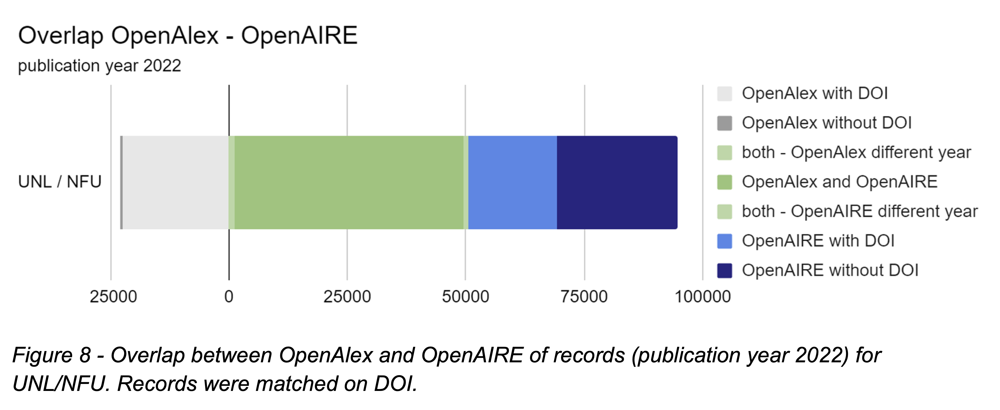

#### "To guarantee both digital sovereignty and quality in reporting, evaluation and findability of Dutch research, Universities of the Netherlands (UNL) recognizes that research information (i.e. metadata on research activities, outputs and impacts, including information on research performing organisations and research funders) should be openly available and governed and controlled by the academic community. "

— [Coverage and quality of open metadata for Dutch research output](https://doi.org/10.5281/zenodo.10629457)

---

For the Open Research Information Agenda (ORIA) of SURF/UNL, I analysed the coverage and quality of open metadata for Dutch research output in open data sources (specifically Crossref, OpenAlex and OpenAIRE).

Role: data analysis, report writing
*Time period: February 2023 - May 2024*

---
