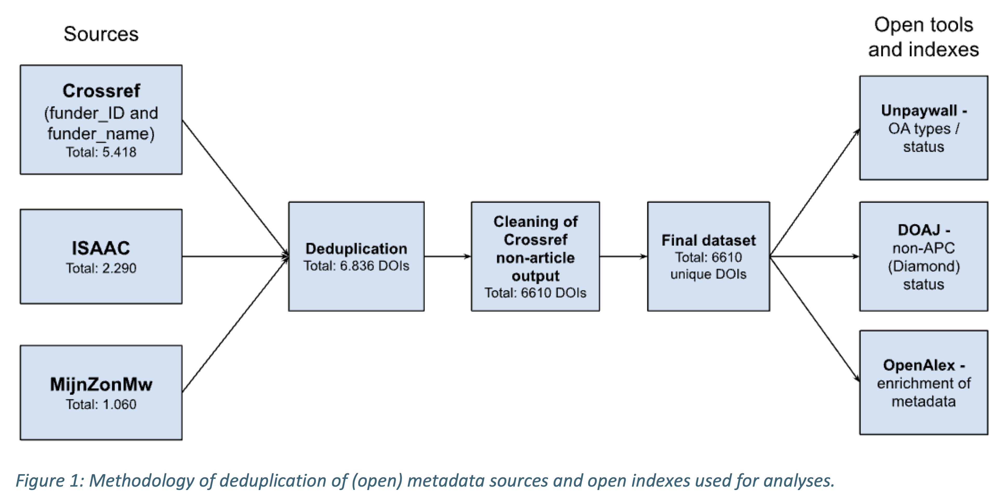

#### "In this report we analysed the openness of publications from research funded by the Dutch Research Council (NWO) and The Netherlands Organisation for Health Research and Development (ZonMw) for the publication year 2023. This research has been conducted exclusively on openly accessible research information and metadata."

- [NWO and ZonMw Open Access Monitor 2023](https://doi.org/10.5281/zenodo.12685800)
---

I worked with NWO and ZonMW to analyze the openness of publications from publication year 2023 resulting from NWO/ZonMW-funded research, using openly accessible research information and metadata.  
In addition, we applied an experimental method to estimate the costs associated with the publications data used in the report, using openly available data collected under the OpenAPC project.

Role: data analysis 
*Time period: June - Oct 2024*

---
