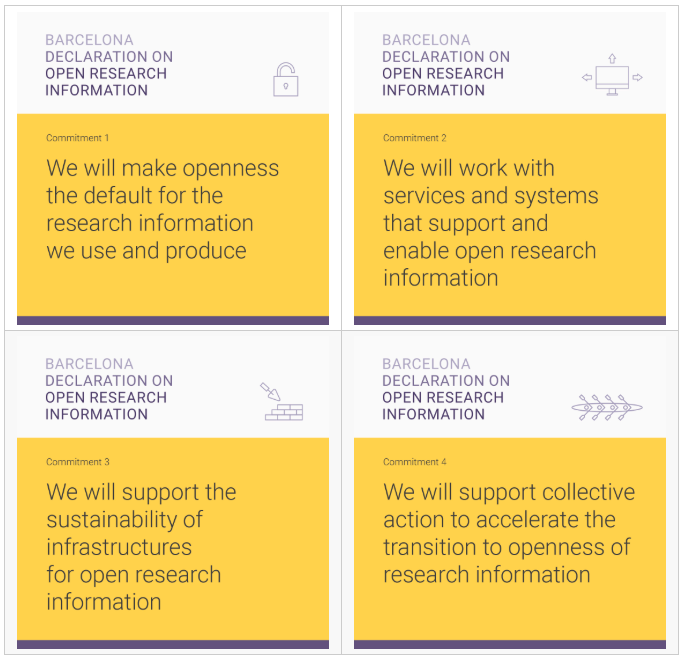

#### "The research information landscape requires fundamental change. The signatories of the Barcelona Declaration on Open Research Information commit to taking a lead in transforming the way research information is used and produced. Openness of information about the conduct and communication of research must be the new norm."

— [Barcelona Declaration website](https://barcelona-declaration.org/)

---

The Barcelona Declaration on Open Research Information was prepared by a group of over 25 research information experts, representing organizations that carry out, fund, and evaluate research, as well as organizations that provide research information infrastructures. It was launched in April 2024.  

In early 2025, the Barcelona Declaration Office was established to coordinate signatory and supporter actions and to promote and foster engagement with the Declaration, and I was appointed Executive Director for the Barcelona Declaration. 

Role: coordinator, Executive Director  
*Time period: Nov 2023 - current*

---
