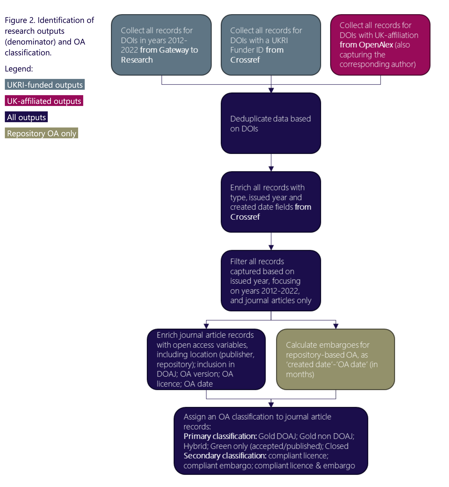

#### "A new study commissioned by UK Research and Innovation (UKRI) to develop a monitoring and evaluation (M&E) framework for their Open Access policy. This framework will seek to enable UKRI and the broader sector to assess progress towards Open Access, levels of compliance with the UKRI policy and its overall effectiveness. The M&E framework will also aim to establish how Open Access publication trends affect academic practices and society, where possible."

— [Research Consulting website - Developing a monitoring and evaluation framework for the UKRI Open Access policy ](https://www.research-consulting.com/developing-a-monitoring-and-evaluation-framework-for-the-ukri-open-access-policy/)

---

I worked as associate to Research Consulting on this project, which identified a series of potential M&E questions, approaches to answer them, their feasibility and expected resource intensity. 
In a follow-up project, we developed a set of baseline values for open access research articles, against which future progress can be assessed. The analysis was based exclusively on open data sources and the data and code have been made available to enable reuse, in line with UKRI’s commitment to open research.  

Role: research associate (subcontracted). 
*Time period: July 2022 - Sept 2023, Okt 2023 - Sept 2024*

