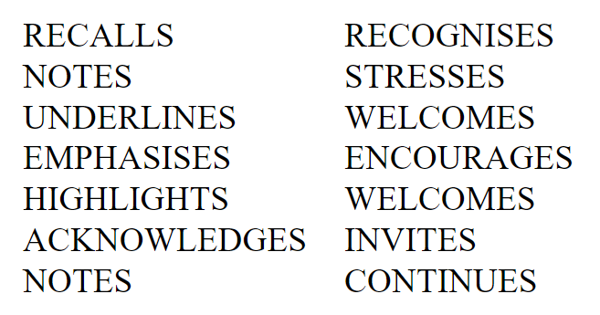

*On May 23, 2023, the Council of the European Union approved a set of conclusions on* ***'High-quality, transparent, open, trustworthy and equitable scholarly publishing'*** *(see [pdf](https://data.consilium.europa.eu/doc/document/ST-9616-2023-INIT/en/pdf)).*  
*Below are some of my thoughts on these conclusions.*
 

I think these Council Conclusions are very welcome and important, as they align with, and in turn can support, a number of important current developments in how open access is perceived and implemented. One of these is the growing awareness, also among research institutions and funders, of the inequality and unsustainability of APC-driven open access publishing, especially by commercial or otherwise revenue-driven publishers. Another is a growing emphasis on important qualitative aspects of open access, in particular immediacy and open licensing. 

In this sense, the Council Conclusions, together with for example the UNESCO Open Science Recommendations and the Action Plan for Diamond Open Access, to name but two, can help shift focus to other models of publishing. One thing I would like to emphasize is that while developing new publishing infrastructures (for example at national or even European level) is in itself a worthwhile avenue to pursue, many examples also already exist of non-profit publishing solutions that deserve support and recognition.

 As an aside, an important point in the Council Conclusions is that "costs should not be covered by individual authors or readers" also means  "authors can publish their work without funding/institutional eligibility criteria". This is especially interesting in light of the endorsement of Open Research Europe, which at least currently does not meet this criterium. If the Council Conclusions can be read as an encouragement to broaden the Open Research Europe model in that sense, this would be a very positive development in my opinion.  

The Council Conclusions are also very explicit in their concern for increasing costs and their call for transparent pricing commensurate with publication services. This can support other initiatives in this area (like cOAlition S Price Transparency Framework) and a more general reconsideration on how public money is spent. One remark (which I often make in this context) is that to be truly informative, such price transparency needs to include transparency on profit or surplus. 

Two areas where I would have liked the Council Conclusions to go further is, first, emphasizing the importance of secondary publishing rights - as this is something that can be taken up by member states as a legislative approach (as it has been in a number of European countries) to enable open sharing of research publications, in particular immediate sharing. Most existing legislation does not go that far yet, and I feel the Council Conclusions could have been stronger in pushing this forward.

Secondly, in the paragraph on monitoring and the "lack of data and trustworthy information on the state of scholarly publishing" (including bibliometric data), while mention is made of the need for such data to be FAIR, I would have liked to see a stronger stance on the importance of open metadata on scholarly publishing, to enable transparency and equitable access to such data. In my view, this is even more important than attempting to ' reduce the fragmentation of monitoring initiatives' - as different entities will have different needs and priorities in monitoring, and open availability of good quality metadata can enable such diversity while still being comparable and transparent. 

As a final observation, the Council Conclusions rightly put much emphasis on the importance of quality, transparency and integrity in scholarly publishing, and also mention the need for a change in research culture "that recognises diverse research activities with the overarching goal to maximise high quality and impact of research", also referring to the activities of the Coalition for Advancing Research Assessment
(CoARA). In my opinion, these two aspects are related and together could  be one of the keys to the question of costs and pricing - if a change in research culture would reduce the pressure to publish in so-called "high-impact" journals for the sake of prestige, and instead focus on methodological quality, openness aspects and reaching the audiences for which the research is most relevant (including societal partners), this would create a more level playing field where "paying for prestige" could be replaced by paying for actual quality, without selectivity for selectivity's sake. 

While the Council Conclusions do not go that far, I am hopeful that the recommendations made can help support a transition into that direction.   
