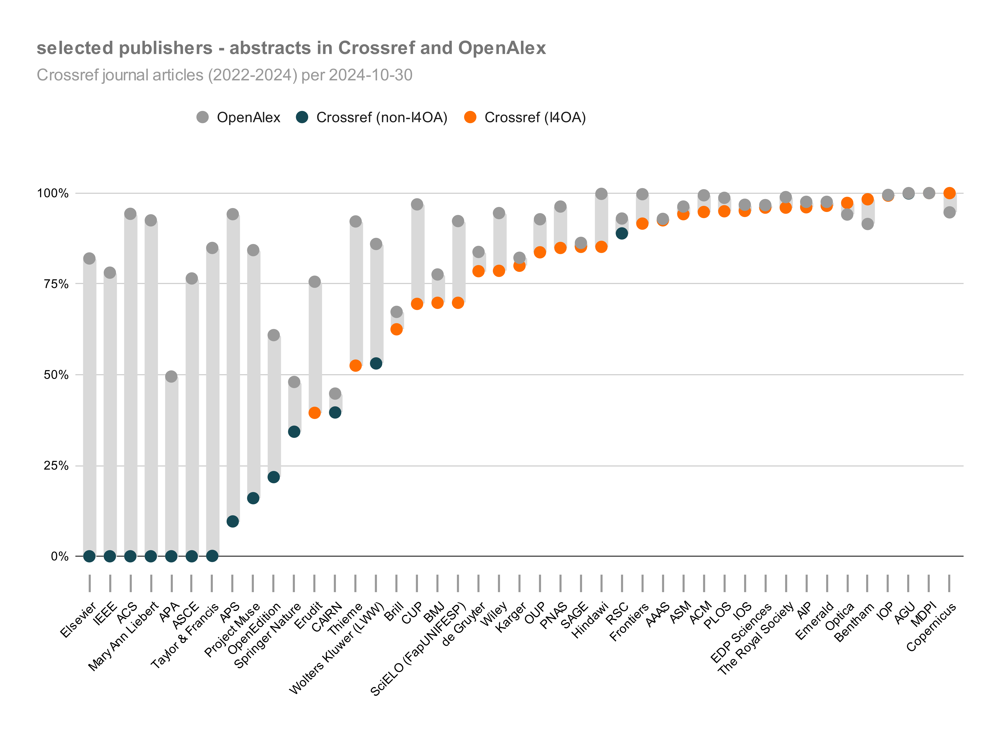

*Abstracts are increasingly important with the rise of  large language models (LLM) and generative AI. While OpenAlex provides a source of open abstracts in addition to Crossref, the takedown of abstracts from OpenAlex by two major publishers points to an increased commodification of abstracts.* 

### The case for open abstracts
Launched in 2020, the [Initiative for Open Abstracts (I4OA)](https://i4oa.org/) advocates and promotes the unrestricted availability of abstracts of scholarly output, particularly journal articles and book chapters, in trusted repositories where they are open and machine-accessible. This has gained increased relevance with the rise of  large language models (LLM) and generative AI. Access to high-quality textual content for training purposes is highly sought after, with the risk of further commodification by publishers and by developers of generative AI models and tools.

As part of a broader movement towards open research information, including the [Barcelona Declaration on Open Research Information](https://barcelona-declaration.org), I4OA calls on all scholarly publishers to open the abstracts of their published works and, where possible, to submit them to Crossref. In October 2024, the proportion of current journal articles[^1] published by Crossref members with open abstracts had reached 52%, up from 21% when I4OA was launched in September 2020. This is thanks to a [growing number of publishers](https://www.crossref.org/blog/i4oa-hall-of-fame-2023-edition/) who deposit abstracts to Crossref, often for close to 100% of their journal articles.

However, there are still large gaps in the availability of abstracts in Crossref. To some extent, these gaps are known (e.g. where publishers do not submit any abstracts at all), but to some extent they are also hidden, since not all journal content necessarily has abstracts (think editorials, letters to the editor, book reviews etc). Depending on the discipline and type of journal(s) in its portfolio, a proportion of 70% open abstracts for a given publisher may in practice mean full coverage, or may indicate there are additional abstracts that are not (yet) openly available.

#### OpenAlex as an additional source of open abstracts

[OpenAlex](https://openalex.org/) is another source where abstracts are brought together in an openly available and machine-readable format. This provides the opportunity to estimate the value of OpenAlex in providing additional coverage of abstracts compared to Crossref. In addition, it can give an indication of the lower bound of the proportion of journal content from any given publisher that can be expected to have abstracts (and that publishers thus can be expected to be able to provide to Crossref). 

While abstracts in Crossref are deposited by publishers themselves, OpenAlex collects abstracts from [external sources](https://help.openalex.org/how-it-works/entities-overview). These include Crossref, but also other structured sources like PubMed, and content obtained by web crawling, including from publisher landing pages ([Priem et al., 2022](https://doi.org/10.48550/arXiv.2205.01833)). In addition, OpenAlex has inherited content previously collected by Microsoft Academic Graph in similar ways prior to its cessation in December 2021. Each abstract is included in OpenAlex as an “[inverted index](https://docs.openalex.org/api-entities/works/work-object#abstract_inverted_index)”, encoding information about the abstract's words and their positions within the text. OpenAlex content is made available under a [CC0 license](https://creativecommons.org/publicdomain/zero/1.0/), allowing unrestricted use and distribution. 

#### Comparing open abstracts in OpenAlex and Crossref

Since the launch of I4OA, we have been tracking the openness of abstracts for all Crossref members over time (for data and code see this GitHub repository). For a subset of 40+, mostly larger, publishers, the proportion of current journal articles that have abstracts deposited in Crossref is shown in a chart on the I4OA website, which is updated quarterly.

For this set of publishers, we compared the proportion of journal articles with abstracts available in Crossref and OpenAlex[^2] in October 2024 for publication years 2022-2024 (Figure 1). Only journal articles with Crossref DOI were included.

_Figure 1. Proportion of journal articles (2022-2024) from selected publishers that have open abstracts in OpenAlex (dark grey dots) and Crossref (orange and blue dots for publishers supporting and not (yet) supporting I4OA, respectively). Publishers are ordered by ascending proportion of open abstracts  in Crossref and descending number of DOIs._  

These data show that for most publishers with less than 90% open abstracts in Crossref, OpenAlex has additional abstracts, obtained from additional sources (including through web scraping). This includes many of the larger publishers that do not (yet) deposit abstracts to Crossref at all, like Elsevier, IEEE, ACS and Taylor & Francis. Overall, the proportion of journal articles from 2022-2024 with Crossref DOIs for which abstracts are available in OpenAlex is 83%, vs 52% with abstracts available in Crossref. Apart from demonstrating OpenAlex as a valuable source of machine-readable abstracts for research articles, this also points to the sizeable potential for improving abstract coverage in Crossref for many publishers, including those that do already provide abstracts for part of their journal content.

#### Publishers with limited abstract coverage in OpenAlex

There are some publishers for which the proportion of abstracts available in OpenAlex is more limited. A general reason for limited abstract coverage in OpenAlex could be the disciplinary effect mentioned above - i.e. less journal content that has abstracts in the first place. 

This might be a factor especially for publishers that operate predominantly in the humanities, like Brill, OpenEdition and CAIRN (a publishing platform in the humanities and social sciences representing a number of individual publishers). Another example is the American Psychological Association (APA), where the relatively low proportion of open abstracts can likely be explained by the inclusion of DOIs for supplementary materials, most of which do not have abstracts.

In cases where the proportion of abstracts in OpenAlex is essentially the same as in Crossref, this could represent the maximal potential (i.e. the remaining content does not have abstracts at all), or, alternatively, it could mean OpenAlex only takes data from Crossref, and does not also crawl the publisher domain itself. 

#### Takedown of abstracts by Springer Nature and Elsevier

In November 2022, OpenAlex took the step to remove abstracts for Springer Nature’s non-open access content (see [GitHub commit](https://github.com/ourresearch/openalex-guts/commit/697b7ecad0c377d6381fd7d3b8608e9b917c76ac#diff-9b971b24d1a1af9cbe2c01f368a6408f0d1f69df0f7a0f1f23bc652d7c4f0abaR851)). Springer Nature similarly supplies abstracts to Crossref only for its open access content ([van Eck and Waltmen, 2024](https://doi.org/10.31222/osf.io/smxe5)). OpenAlex still has more abstracts for Springer Nature than Crossref (48% vs 34%). This can be explained by the observation that green open access articles (where an open access version of the article is available in a repository) continue to have abstracts included in OpenAlex. 

Now, two years later (in November 2024) Elsevier seems to have taken similar steps to have abstracts from closed articles removed from OpenAlex (see [GitHub commit](https://github.com/ourresearch/openalex-guts/commit/697b7ecad0c377d6381fd7d3b8608e9b917c76ac#diff-9b971b24d1a1af9cbe2c01f368a6408f0d1f69df0f7a0f1f23bc652d7c4f0abaR851)). The effect of this step is already visible in the OpenAlex web UI and API, and is expected to affect the data snapshot from November 2024 forward. With current abstract coverage for Elsevier at 82% in OpenAlex, this will result in the loss of approximately 1,1M abstracts for [current closed journal articles](https://openalex.org/works?page=1&filter=primary_location.source.publisher_lineage%3Ap4310320990,open_access.is_oa%3Afalse,type%3Atypes%2Farticle,primary_location.source.type%3Asource-types%2Fjournal,publication_year%3A2022-2024), and up to 11.5M abstracts for [closed journal articles of all years](https://openalex.org/works?page=1&filter=primary_location.source.publisher_lineage%3Ap4310320990,open_access.is_oa%3Afalse,type%3Atypes%2Farticle,primary_location.source.type%3Asource-types%2Fjournal). 

#### Discussion and conclusions

It is encouraging to see considerable abstract coverage in both Crossref and OpenAlex, as it increases the corpus of machine-readable abstracts which are publicly available for use. The fact that OpenAlex in many cases manages to capture more abstracts than are available in Crossref, even for publishers who do provide abstracts for some of their articles to Crossref, points to a gap that publishers themselves can close if they so choose. 

Regarding the use of scholarly material, including abstracts, for the development of LLM and generative AI applications, this still poses many questions (see e.g. [Pooley 2024]{https://doi.org/10.54900/zg929-e9595). These include:
- the legality of using licensed or unlicensed copyrighted material, both for training and for producing new texts, and the question whether such new texts can be considered derivatives;
- the implications of various Creative Commons licenses in this context (i.e. can CC-BY licensed material be used in bulk without individual attribution?); 
- the role of fair use (in the US) and sui generis database rights (in the European Union), respectively, to enable and/or restrict use of scholarly material;
- the desirability of the use of scholarly material in commercial generative AI tools (including these developed and used by publishers), as well as the desirability of commercial publishers licensing scholarly material to developers of generative AI models and tools, as an additional revenue stream;
- the public benefit of using high-quality textual information in the development of generative AI applications.

In these discussions, abstracts hold a somewhat special position as they are treated both as metadata (generally not subject to copyright) and as part of creative works (which are subject to copyright). 

After Springer Nature, Elsevier is now the second publisher that has taken steps to have abstracts removed from OpenAlex. Coupled with announcements earlier this year of Elsevier announcing their own AI tool which makes ample use of abstracts, as well as selling the right to use and display abstracts from its own journals to a third party tool developer, this makes clear that abstracts are in growing danger of being treated as a commodity, rather than as open research information. Coupled with announcements earlier this year of Elsevier [announcing their own AI tool](https://www.elsevier.com/products/scopus/scopus-ai) which makes ample use of abstracts, as well as [selling the right to use and display abstracts from its own journals to a third party tool developer](https://www.sspnet.org/community/news/cactus-and-elsevier-join-hands-to-bring-19m-elsevier-research-abstracts-to-researchers-mobile-devices/?utm_campaign=coschedule&utm_source=twitter&utm_medium=ScholarlyPub&utm_content=Cactus%20and%20Elsevier%20Join%20Hands%20to%20Bring%2019M%2B%20Elsevier%20Research%20Abstracts%20to%20Researchers%27%20Mobile%20Devices), this makes clear that abstracts are in growing danger of being treated as a commodity, rather than as open research information. 

Open abstracts, either in Crossref or in OpenAlex (where they are made available with a CC0 public domain dedication, but are subject to takedown), provide a welcome antidote to this development. Not only does this make abstracts publicly available for use and re-use, it also serves as an opportunity for the scholarly community to discuss how open we want abstracts to be and how to achieve that. 

#### Code and data availability

- Code: https://github.com/bmkramer/more_open_abstracts
- Aggregated data: https://doi.org/10.5281/zenodo.11580550

The analysis underlying this work was performed using Curtin Open Knowledge Initiative (COKI) infrastructure, which is documented on GitHub: https://github.com/The-Academic-Observatory. It uses data snapshots of Crossref and  OpenAlex ingested into a Google Big Query environment where they can be queried via SQL.

[^1]: For the purpose of registration and analysis, Crossref defines “current” as the current calendar year and  the previous two calendar years. 

[^2]: The results reported here only represent the absence/presence of any text in the abstract field in OpenAlex and Crossref. This does not, in itself, say anything about the quality and completeness of the abstract in either database. Previously, concerns have been raised about the [quality of abstracts in Microsoft Academic](https://www.leidenmadtrics.nl/articles/why-openly-available-abstracts-are-important-overview-of-the-current-state-of-affairs#:~:text=abstracts%20suffer%20from%20some%20quality%20problems), and it would be interesting to do a follow-up investigation into the quality of abstracts collected by OpenAlex (e.g. abstracts for articles published from 2022 onwards). 