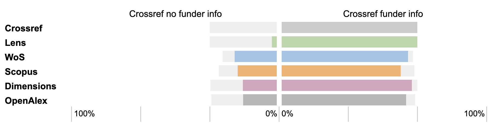

*With a grant from Wellcome, OpenAlex is working to improve its coverage of funding metadata. The three-year project started in September 2025, and the effects are already visible. Building on an earlier study, we show that OpenAlex is already performing almost as well as Dimensions.* 

### OpenAlex and funding data
In recent years, [OpenAlex](https://openalex.org) has grown into one of the largest open bibliographic databases of scientific literature. However, funding information was never a high priority. OpenAlex did have “funders” and “grants,” and took this information directly from Crossref, which is known to be incomplete. In addition OpenAlex also had Crossref grant ID’s. Large proprietary databases such as Scopus, Web of Science, and Dimensions are known to have much more complete funding metadata. With the financial support of [Wellcome](https://wellcome.org/insights/articles/wellcome-announces-suite-open-research-measures), OpenAlex is now rapidly catching up with this gap. 

The aim of the [project](https://github.com/ourresearch/openalex-walden/blob/main/plans/awards/ApplicationForm-Demes-323416-Z-24-Z.pdf) is to fully integrate funding metadata into the database and make it a first-class citizen. In addition to making better use of existing sources of funding metadata such as Crossref and Datacite, OpenAlex aims to use two new sources:

- mining the acknowledgment section from full-text articles
- working with funders' own registries. The idea is to not only ingest the grant information that many funders make available publicly, but also the works that many funders have linked to grants in their own output registries. 

Once the corpus of grant information is large enough, the ambition is also to make better connections between grants and works. 

#### First results

Where does OpenAlex stand now, a few months after the project's launch? And how does its coverage compare to Crossref and proprietary databases? To find out, we took a dataset of publications that we have previously used, namely a corpus of 5,004 publications resulting from funding from the Dutch Research Council NWO. In 2022, we used these publications to study the availability and completeness of funding metadata in Crossref ([de Jonge and Kramer, 2022](https://doi.org/10.1162/qss_a_00210)). We found that of the 5,004 publications, 67% had some funding information with a subset correctly acknowledging NWO as funder with the funder name (53%) and correct funder ID (45%).

We also compared these scores with four other bibliographic databases: Web of Science, Scopus, Dimensions, and Lens, and concluded that each of these databases was able to report funding information for additional publications for which no funding metadata had been deposited in Crossref. For the three commercial databases that amounted to up to 1,000 extra publications which lacked funding metadata in Crossref. 

We have now run the same publication data through OpenAlex and can therefore compare how OpenAlex performs against those other bibliographic databases. The figure below shows the results of that exercise. 

_Figure 1. Performance of five bibliographic databases in providing funder information compared to Crossref. Light grey bars show publications found in each database that either lack (left) or have (right) funder information in Crossref. The colored bars show the proportions of each of these sets of papers for which the other databases have funder information._

In summary, OpenAlex has made considerable progress in a short period of time. Of the 5,004 publications, it now (February 2026) has funding information for 3,903 (or 78,0%). This means that OpenAlex performs exactly as well as Scopus (78,1%) and slightly less well than Dimensions (81,1%) and Web of Science (83,1%). 

As Crossref has been an important source for OpenAlex, it is somewhat surprising to see that OpenAlex does not have funding information for all publications that have funding metadata in Crossref: 224 publications are missing. A closer inspection revealed that of those 224 records 78 did have a funder DOI in Crossref (so might be glitch worth looking at by OpenAlex), 145 only had one or more funder names, but no Funder ID (which arguably should not be a reason to not link the publication to a funder), and 1 only had an award number, without funder indication. 

In addition to 3,071 publications that also have funding information in Crossref, OpenAlex has found 832 additional publications with funding information. That is just as good as Dimensions (840). Scopus and Web of Science do slightly better with 962 and 1,042 respectively, suggesting that both may have access to additional sources of funding information ([Baas, Schotten et al., 2020](https://doi.org/10.1162/qss_a_00019)): either metadata directly obtained from publishers or funding information from full text articles OpenAlex (and Dimensions) have no access to.

#### Sources

The main source for the additional funding information in OpenAlex appears to be the mining of full-text articles. 3,202 of the 5,004 articles now contain the field “grobid_xml” (as part of “has_content”) in OpenAlex, which indicates that OpenAlex has the content and has mined it using GROBID ([GeneRation Of BIbliographic Data](https://github.com/grobidOrg)) an open source machine learning tool for extracting encoded documents like PDFs. 

For now, OpenAlex seems to apply text mining primarily to articles that are full-text available from publisher websites: in our corpus, 78% of articles labeled gold, hybrid or bronze OA had the “grobid_xml” tag, versus 7% of green OA articles (and 0% of closed articles). 

Of the 3,903 articles with funding information in OpenAlex,  2,031 have both funding information in Crossref and were text-mined, 667 were text-mined only, and 1,030 were not text-mined, but had funding information in Crossref (Fig 2). This leaves 165 articles for which OpenAlex has other sources of funding information.  

_Figure 2. Further breakdown of the articles in our dataset with funding information in OpenAlex._  

Currently, these additional sources are non-pdf fulltext, landing pages, and n-grams. In future, OpenAlex is planning to also capture works that have been linked to grants in funder registries, such as the [NWO Open API](https://data.nwo.nl/en/how-to-use-the-nwopen-api) which provides access to structured data on NWO funded projects and their outputs. In addition OpenAlex has announced exploring the idea of encouraging institutions to extract funding links from full text of closed articles they have text and data mining right to, and expose those links through the institutional repository for harvesting by OpenAlex ([OpenAlex, 2026](https://www.youtube.com/watch?v=BcnigbsDKpw&t=3190s)). It will be interesting to see how far OpenAlex will come compared to its commercial competitors using this combination of approaches. 

#### A call to publishers

The progress OpenAlex has made in just a few months is remarkable. From a database that long had no funding metadata and then only limited data, to a platform that now performs almost on par with commercial competitors such as Dimensions and Scopus - this is an impressive achievement. The speed at which OpenAlex is closing this gap is encouraging.

Yet it is worth being clear that what OpenAlex is doing is compensating for a structural failure upstream. The funding metadata that OpenAlex is now mining from full-text articles and landing pages was always there - in acknowledgment sections, in grant numbers, in funder names. It simply was never captured and deposited by publishers in Crossref. OpenAlex deserves credit for filling that gap, but the gap should not have existed.

Funders can be expected to provide clear guidance to their grantees to acknowledge funding in publications and preferably mint DOIs for their grants. But good research information citizenship equally requires publishers to capture this metadata as a structural part of their publication workflows and make it available as structured open metadata - not leave it to others to retrieve it after the fact.

We hope that the progress OpenAlex is making and the attention this project brings - will ultimately also accelerate these structural changes towards richer, openly deposited funding metadata at the source.

#### Data and code: 
https://doi.org/10.5281/zenodo.19216189

#### About the authors:
- *Bianca Kramer is independent research analyst at Sesame Open Science and Executive Director of the Barcelona Declaration on Open Research Information*  
- *Hans de Jonge is Director Open Science NL, part of Dutch Research Council NWO, and co-coordinator of the Barcelona Declaration working group on Funding metadata.*

