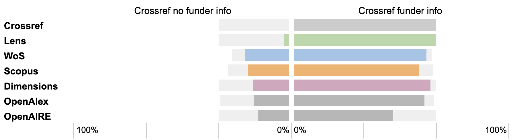
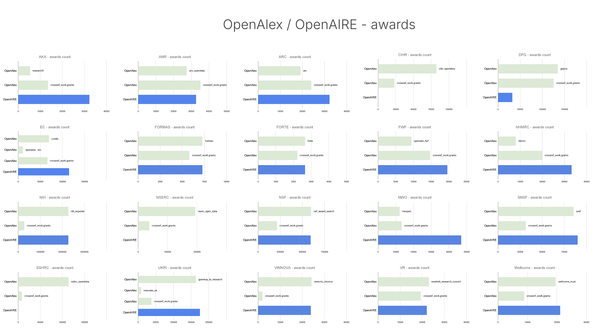
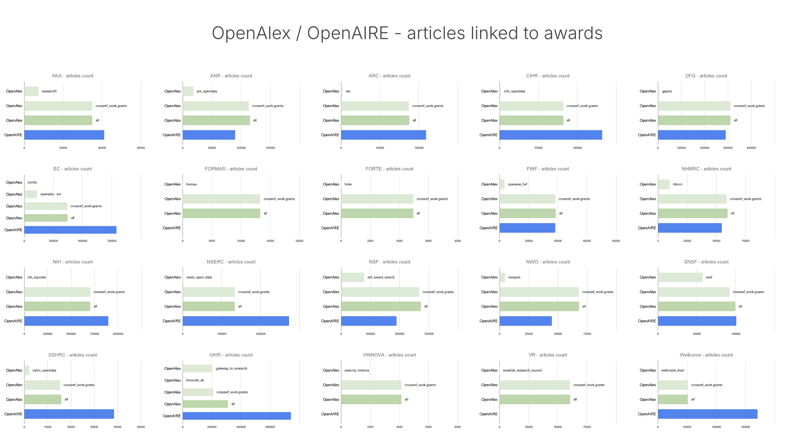
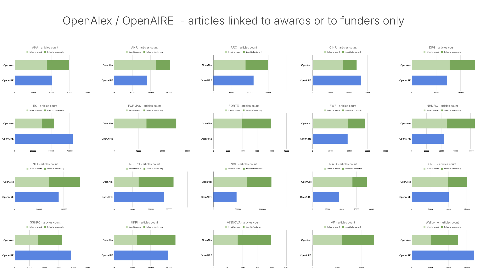

doi: <a href="https://doi.org/10.59350/q125k-sfg48">https://doi.org/10.59350/q125k-sfg48</a>
  
  
*With a grant from Wellcome, OpenAlex is working to improve its coverage of funding metadata, with effects that are already visible. In this context, OpenAlex is part of a wider ecosystem of databases collecting and providing open funding metadata, including OpenAIRE and EuropePMC. Here we compare the presence of funder information in OpenAlex and OpenAIRE for a set of NWO-funded publications. We also look at the coverage of awards and linked publications for 20 funders for which both OpenAlex and OpenAIRE currently collect information directly from funders.* 

***Disclaimer: the results reported here reflect the data in OpenAlex and OpenAIRE at  specific points in time (late Jan-March 2026) which may have undergone changes since then given the dynamic nature and continuous development of these databases.***

### Two databases

##### OpenAlex - recent developments
Until recently, [OpenAlex](https://openalex.org) only took funding information from Crossref, which relies on publisher-supplied information and funders registering grant DOIs. With the financial support of the Wellcome Trust, OpenAlex has started a [project](https://github.com/ourresearch/openalex-walden/blob/main/plans/awards/ApplicationForm-Demes-323416-Z-24-Z.pdf) to work with funders' own registries to ingest grant information and works that funders have linked to grants in their own output registries, in addition to mining the acknowledgment section from full-text articles. Currently, OpenAlex takes information on grants directly from 35 funder-supplied sources[^1], in addition to taking funding information from Crossref for many more funders. 

[^1]: https://api.openalex.org/awards?group_by=provenance

##### OpenAIRE - long-standing efforts 
[OpenAIRE](https://graph.openaire.eu/) has been collecting information from participating funders for 10 years[^2], linking grants and research outputs through both direct harvesting and inference from funding acknowledgements. Originally focusing on a small group of national funders in Europe, the US and Australia, OpenAIRE now includes projects from 230 funders. Following recent targeted efforts, this includes many smaller funders and institutions in Ireland, Sweden and Finland. 

[^2]:  https://web.archive.org/web/20160319024240/https://www.openaire.eu/funders-functionalities (archived from March 19, 2016)

#### Two comparisons

To compare coverage of funding information in OpenAlex and OpenAIRE, we first looked at presence of funder information in OpenAlex and OpenAIRE in a predefined set of NWO-funded publications. We then looked at the coverage of awards and linked publications for 20 funders for which both OpenAlex and OpenAIRE currently collect information directly from funders.

##### Comparison I - publications resulting from NWO funding
We recently analysed how well OpenAlex performs in terms of funder coverage using a dataset of 5,004 publications resulting from funding from the Dutch Research Council NWO. In 2022, we used this dataset to study the availability and completeness of funding metadata in Crossref, compared to four other bibliographic databases: Web of Science, Scopus, Dimensions, and Lens ([de Jonge and Kramer, 2022](https://doi.org/10.1162/qss_a_00210)).

In our recent [blog post](https://doi.org/10.59350/ywdc4-eck58), we compared how OpenAlex performed against those other bibliographic databases in February 2026. Of the 5,004 publications, OpenAlex had funding information for 3,903 (or 78,0%). This means that OpenAlex performs exactly as well as Scopus (78,1%) and slightly less well than Dimensions (81,1%) and Web of Science (83,1%). 

To complement this analysis, we ran the same publication data through OpenAIRE (data snapshot of January 29, 2026) and can therefore compare how OpenAlRE performed at that time against OpenAlex and the other bibliographic databases for this specific dataset. The figure below shows the results of that exercise. 

_Figure 1. Performance of six bibliographic databases in providing funder information compared to Crossref. Light grey bars show publications found in each database that either lack (left) or have (right) funder information in Crossref. The colored bars show the proportions of each of these sets of papers for which the other databases have funder information._

In summary, OpenAIRE has funding information for 3,055 (or 61,0%) of the 5,004 publications. While OpenAIRE finds funding information for a considerable number of publications (732) that lack this information in Crossref, it also lacks funding information for 1,027 publications that have this information in Crossref. 

This is not necessarily surprising: funding information in OpenAIRE is linked to projects, not funders directly, so it is possible that OpenAIRE could not match these publications to a specific project of NWO or another one of the funders in its scope.

##### Comparison II - funders covered by both OpenAlex and OpenAIRE

For the second comparison, we looked at the 20 funders for which both OpenAlex and OpenAIRE collect award information directly from funders. These include the European Commission (incl FP7, Horizon Europe and Horizon2020 programmes), NIH and NSF in the US, the Canadian Tri-Agency (CIHR, NSERC and SSHRC), the Australian Research Council (ARC) and National Health and Medical Research Council (NHMRC), the national research councils of Finland (AKA), France (ANR), Germany (DFG), Austria (FWF), the Netherlands (NWO), Switzerland (SNSF) and the UK (UKRI), and four national funding agencies in Sweden (FORTE, FORMAS, VINNOVA and Vetenskapsrådet (VR)). Wellcome Trust completes the set of 20 funders as the only charitable funder in the list. 

Using full data snapshots of OpenAlex (2026-03-30) and OpenAIRE (2026-01-29) in Google Big Query, we compared the number of awards (OpenAlex) and projects (OpenAIRE) per funder, and the number of publications linked to each funder in both databases. In order to perform a like-for-like comparison, we limited publications to journal articles with a Crossref DOI. 

###### Awards
In both databases, awards (OpenAlex) and projects (OpenAIRE) are a separate database entity, both representing single grants awarded by a funder. For OpenAlex, a provenance field is included, indicating whether the award was harvested from Crossref or from a specific funder database. It should be noted that the OpenAlex data snapshot used (March 2026) did not yet include Crossref Grant DOIs as grants.

Figure 2 shows, for each funder, the number of awards identified from each source in both OpenAlex and OpenAIRE. In most (but not all) cases, OpenAlex collects more grants from funder databases than are retrieved from Crossref, and the number of grants collected from funder databases is roughly similar in OpenAlex and OpenAIRE. There are some notable exceptions though: OpenAIRE captures considerably more awards for AKA, FWF, NWO, the EC and the Australian national funders, and considerably fewer for DFG and the Canadian Tri-Agency. For the latter, it appears that OpenAIRE uses a single nominal project ID for each funder, and links all publications to that project ID. 

_Figure 2. Capture of awards/projects by OpenAlex (light green) and OpenAIRE (blue), respectively. Multiple light green bars indicate the different sources that awards are harvested from by OpenAlex (both Crossref and funder-specific databases/portals), with the name of the source as provided in the metadata field ‘provenance’._

###### Publications linked to awards
Both databases link awards directly to publications. Figure 3 shows the number of publications linked to awards per funder, separated out by the source of the awards, and limited to journal articles in Crossref.  For OpenAlex, also the total number of (unique) publications is shown to allow a more direct comparison with OpenAIRE.

Across all funders, OpenAlex currently has far fewer publications linked to awards sourced from funder registries than identified in Crossref. This is not surprising since in the Wellcome funded project, the initial focus was on ingest of grant information. It is to be expected that the proportion of publications linked to these grants (either through direct harvesting of publication information from funder databases, or from matching on funding acknowledgements in full text) will further increase over time. 

For many funders, the number of publications linked directly to grants in OpenAIRE equals or exceeds the total number in OpenAlex. Exceptions include NWO, ANR and NSF, and the four Swedish funders. For the latter, none or very few publications were linked to grants both in OpenAlex and OpenAIRE, pointing to potential common issues with identifying grants for these funders.  For the EC, Canada Tri-Agency, UKRI and Wellcome, OpenAIRE currently has considerably more publications linked to grants than OpenAlex.

_Figure 3. Capture of publications (journal articles with Crossref DOIs) linked to awards / projects in OpenAlex (green) and OpenAIRE (blue), respectively. Multiple light green bars indicate the number of publications linked to awards harvested from  different sources in OpenAlex (both Crossref and funder-specific databases/portals), with the total number of unique publications represented by the darker green bar._

###### Publications linked to funders
In OpenAIRE, the primary relation between funders and publications  is through project-publication links[^3]. In contrast, in OpenAlex publications can also be linked to funders directly. Figure 4 shows the number of unique publications linked to each funder, in addition to the publications already identified through publication-award links. It is assumed that these publications are either identified via funder metadata in Crossref (where the funder ID or funder name is present, but no award information is included), or through full-text matching of funder acknowledgements. 

[^3]: In OpenAIRE, publications are also directly linked to datasources, which include Funder databases and Funder CRIS systems. Furthermore, for each project-publication link information is available on the provenance of the connected: either harvested or inferred. These relations were not explored as part of this analysis.

When publications linked directly to funders (but not to awards) are added, the total number of publications per funder in OpenAlex generally exceeds that in OpenAIRE. Two notable exceptions are Wellcome and the European Commission, for which OpenAIRE identifies a notably larger number of publications than OpenAlex, even when publications linked to the funder, but not the grant, are included. The performance of OpenAIRE for European Commission funding in particular is perhaps not surprising, given that OpenAIRE originated as an [EC-funded project](https://www.openaire.eu/openaire-project) itself to support the implementation of open access in Europe.

_Figure 4. Capture of publications (journal articles with Crossref DOIs) linked to awards (light green) or only to funders directly (dark green) in OpenAlex, and to projects in OpenAIRE (blue)._

#### Two considerations

For both comparisons described here, analysis is limited to the detection of awards/projects and publications linked to a funder, without further characterization and comparison of the observed links themselves. In addition, the analyses only look at funders for which both OpenAlex and OpenAIRE harvest information directly from the funder itself. This gives rise to two important limitations. 

##### Coverage versus quality
Based on counts of awards or linked publications alone, it cannot be concluded whether OpenAlex or OpenAIRE does ‘better’.  First, there are inherent differences in the approach of both databases, such as the explicit links to projects in OpenAIRE versus the additional direct links to funders in OpenAlex, that give rise to different outcomes. 

Second, the accuracy of the detected links, not just their number, determines the quality of the resulting information. A more qualitative analysis of the results, including whether both databases identify the same or different links, and whether the links themselves are correctly asserted, is outside the scope of this initial analysis. This will be an important step to further assess the nature of the differences between both databases

##### Diversity of funders included
The funders included in this analysis are mostly larger national funders from Western countries. Both OpenAlex and OpenAIRE also collect information directly from other funders. This information is currently unique to each database and provides important additional value, especially where it concerns smaller funders or funders from other geographical regions. Below is the list of funders for which currently either only OpenAlex or only OpenAIRE collects information directly from the funder, showing the diversity in coverage across both databases that could not be captured in this analysis.

###### OpenAIRE
- *Croatian Science Foundation (HRZZ) - Croatia*
- *Fundação para a Ciência e a Tecnologia (FCT) - Portugal*
- *Latvian Council of Science (LCS) - Latvia[^4]*
- *Ministry of Education, Science and Technological Development of Republic of Serbia (MESTD) - Republic of Serbia*
- *Ministry of Science, Education and Youth of the Republic of Croatia (MSES-MZOS) - Croatia*
- *Research and Innovation Foundation (RIF) - Cyprus*
- *Research Council of Norway (RCN) - Norway*
- *Teknologi Pendidikan ID (EDTECH-ID) - India[^4]*
- *Türkiye Bilimsel ve Teknolojik Araştırma Kurumu (TÜBITAK) - Turkey*
- *150+ mostly smaller funders and institutions in Ireland[^5]*
- *multiple funders/foundations in Finland (18)[^6], Sweden (11)[^6] and Denmark (6)*

[^4]: nominal project_id, no works linked (yet)
[^5]: mostly nominal project_id
[^6]: no works linked (yet)

###### OpenAlex
- *Agencia Estatal de Investigación (AEI) - Spain*
- *Agencia Nacional de Investigación y Desarrollo (ANID) - Chili*
- *Bill and Melinda Gates Foundation - United States*
- *Bundesministerium für Bildung und Forschung (BMBF) - Germany*
- *Fundação de Amparo à Pesquisa do Estado de São Paulo (FAPESP) - Brazil*
- *Grantová Agentura České Republiky (GAČR) - Czechia*
- *Instituto de Salud Carlos III (ISCIII) - Spain*
- *Japan Society for the Promotion of Science (JSPS) - Japan*
- *Narodowe Centrum Nauki (NCN) - Poland*
- *National Aeronautics and Space Administration (NASA) - US*
- *National Institute for Health and Care Research (NIHR) - United Kingdom*
- *US Department of Defense - United States*
- *US Department of Energy - United States*

#### One conclusion
OpenAlex and OpenAIRE differ in the funding information they capture and make available. Observing these differences provides both an opportunity for triangulation of the resulting information and underlying methodology, as well as a more complete picture of the funding landscape and links with research outputs. 

In short, the existence of multiple open infrastructures (including, but not limited to OpenAlex and OpenAIRE) that aggregate funding information is a strength, not a weakness in the system. This is especially true where the underlying methodologies and algorithms are transparent and auditable. 

Users of research information can take advantage of the diversity and wider coverage provided by multiple sources, and the opportunity for retrieving, combining and assessing data that is an essential benefit of open research information. Funders benefit from making information on their funding programs and grants openly available, so it can be used in multiple databases.

#### Data and code: 
- Data sources: 
  - OpenAlex (API 20260131, data snapshot 20260330)
  - OpenAIRE (data snapshot 20260129)
  - Crossref (data snapshot 20260331)
  - All data snapshots are hosted on Google Big Query as part of the [ORION DBs collection](https://orion-dbs.community/).
- Data and code:
  - Comparison I: https://doi.org/10.5281/zenodo.19216189
  - Comparison II: https://doi.org/10.5281/zenodo.20012683

#### About the author:
*Bianca Kramer is independent research analyst at Sesame Open Science and Executive Director of the Barcelona Declaration on Open Research Information. This piece is written in a personal capacity.*  
  
*The author thanks Hans de Jonge and Cameron Neylon for discussions and comments on this piece - any inaccuracies in analysis and interpretation remain the responsibility of the author.*

